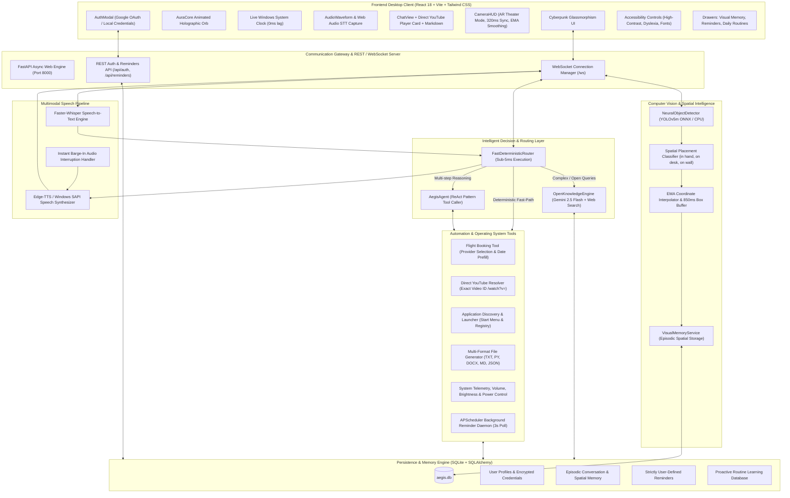
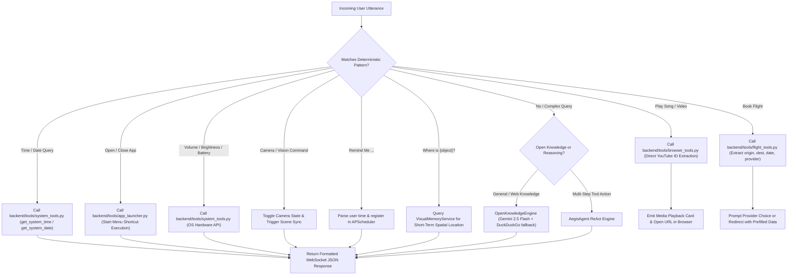
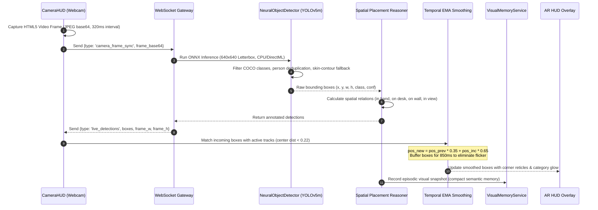
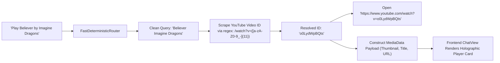
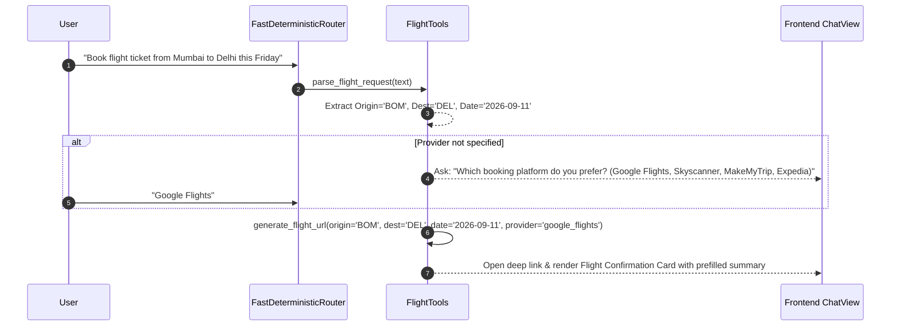
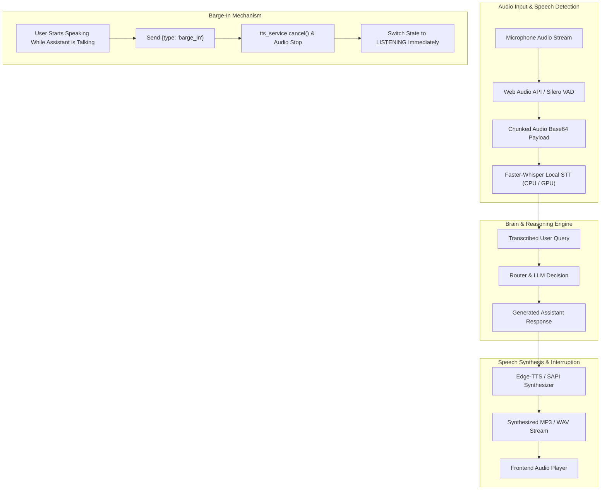
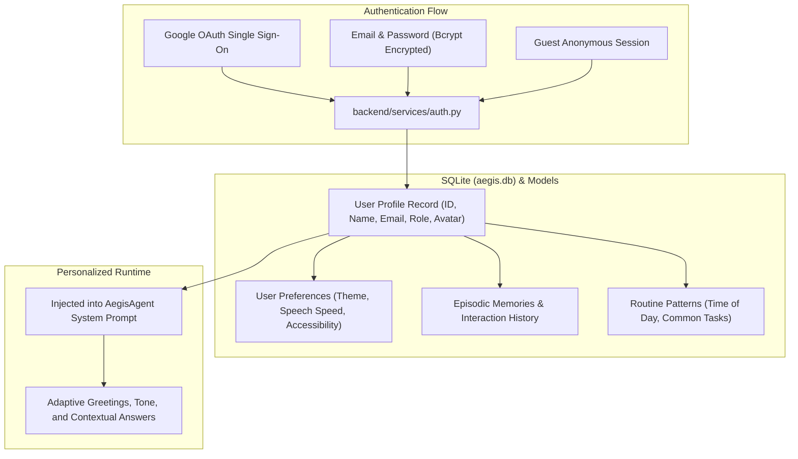

# AEGIS — Assisted Executive Guidance and Intelligence System
## Comprehensive System Architecture, Implementation Flowcharts & Technical Brief

**SIH Domain**: SIH2611 — Assistive Technologies and Inclusive Innovation  
**Problem Statement ID**: SIH26204  
**Problem Statement**: AI-Powered Personal Assistant for Proactive Daily Task Automation and Inclusive Accessibility  
**Target Platform**: Windows 10/11 Desktop (Web/Electron Architecture)

---

## 1. Executive Summary & Vision

**AEGIS** (Assisted Executive Guidance and Intelligence System) is a state-of-the-art, agentic Windows AI Personal Assistant engineered to merge:
1. **Conversational Brain**: Deep reasoning, broad general knowledge, and contextual memory powered by Google Gemini and real-time DuckDuckGo web search.
2. **Autonomous OS & Desktop Automation**: Low-level Windows control, application discovery, file generation, browser automation, and computer-use actions.
3. **Environmental Computer Vision & Spatial AR Memory**: Real-time YOLOv5m deep neural detection, Exponential Moving Average (EMA) coordinate smoothing, Cyberpunk AR HUD with Theater Mode, and episodic spatial memory.
4. **Hands-Free Multimodal Audio**: Low-latency Faster-Whisper Speech-to-Text (STT), high-quality Edge-TTS synthesis, and instant speech barge-in cancellation.
5. **Direct Task Automation**: Direct YouTube video playback without intermediate search pages, smart flight booking redirector with query prefilling, and strictly user-anchored reminder scheduling.
6. **Inclusive Accessibility**: Tailored for individuals with diverse accessibility needs through High-Contrast, Large Font, OpenDyslexic typography, Voice-First navigation, and Low Cognitive Load modes.
7. **Secure Authentication & Adaptive Profile Memory**: Google OAuth and authenticated user profiles stored in local SQLite, enabling personalized responses, routine tracking, and long-term memory.

---

## 2. Master System Architecture Flowchart



---

## 3. Detailed Component Architecture

### 3.1. Frontend Presentation Layer (`frontend/src/`)
Built with **React 18**, **TypeScript**, and **Tailwind CSS**, delivering a high-tech holographic cyberpunk glassmorphism visual theme:
- **`App.tsx`**: Central coordinator managing WebSocket lifecycle, system states (`IDLE`, `LISTENING`, `THINKING`, `SPEAKING`), notification toasts, drawer states, and modal overlays.
- **`AuraCore.tsx`**: Dynamic animated orb that reacts to state transitions (breathing in IDLE, expanding waves in LISTENING, rotating cyan rings in THINKING, pulsing voice ripples in SPEAKING).
- **`LiveClock.tsx`**: Independent millisecond-accurate Windows system clock synchronized with native Windows datetime to eliminate LLM hallucinations on time/date.
- **`CameraHUD.tsx`**:
  - **Standard View**: Expanded `540px - 680px` width with `460px` video viewport.
  - **Theater Mode**: Centered `960px` modal with backdrop blur overlay and `620px` viewport.
  - **Sci-Fi AR Visuals**: 4 corner reticles (`┌ ┐ └ ┘`), categorized glowing color themes (Human, Device, Container, Furniture, Art, Object), and center aiming reticle.
  - **EMA Temporal Smoothing**: Smooths bounding box motion across frames and retains boxes for 850ms to eliminate flicker.
  - **Interactive Targets Strip**: Horizontal scrolling chips of locked targets with 1-click query execution.
- **`ChatView.tsx`**:
  - Responsive chat feed with custom markdown rendering.
  - **Direct YouTube Player Card**: Renders high-definition video thumbnail, pulsating playback indicator, animated equalizer bars, and instant external watch link.
- **`AuthModal.tsx`**: Comprehensive authentication modal supporting Google OAuth single-sign-on simulation, local email/password registration, password strength metering, avatar selection, and profile editing.
- **`AccessibilityBar.tsx`**: SIH-compliant accessibility toolbar supporting High-Contrast mode, Large Font scaling, OpenDyslexic font, Voice-First navigation, and Low Cognitive Load mode.

---

### 3.2. Fast Deterministic Router (`backend/agent/router.py`)

A high-performance intent classifier and deterministic execution engine that resolves requests in **< 5 milliseconds** without calling remote LLMs whenever deterministic accuracy is required.



---

### 3.3. Computer Vision & Real-Time Neural Detection Pipeline



---

### 3.4. Direct YouTube Playback Engine

Unlike traditional assistants that simply open the YouTube search query page (`youtube.com/results?search_query=...`) requiring manual user clicks:
1. **Extraction**: `FastDeterministicRouter` captures the query (e.g., *"Play Believer by Imagine Dragons"* or *"Play Tum Hi Ho"*).
2. **ID Scraping & Resolution**: `resolve_youtube_video(query)` in `backend/tools/browser_tools.py` scrapes the top video result via lightweight HTTP requests and extracts the exact 11-character video ID (e.g. `o0LydWpBQts`).
3. **Instant Direct Launch**: Automatically executes `webbrowser.open("https://www.youtube.com/watch?v=" + video_id)`.
4. **Interactive Cyber Card**: Passes `media_data` payload to the frontend, which renders an animated player card with HD video thumbnail, pulsating playback indicator, and animated equalizer bars.



---

### 3.5. Flight Booking & Travel Assistant Flow

When the user asks to book a flight (e.g., *"Book a flight from Mumbai to Delhi on Friday"*):
1. **Natural Language Parsing**: `backend/tools/flight_tools.py` parses origin airport, destination airport, departure date, and optional return date.
2. **Missing Provider Prompt**: If the user hasn't specified a booking website, AEGIS prompts them with supported platforms:
   - **Google Flights**
   - **Skyscanner**
   - **MakeMyTrip**
   - **Expedia**
   - **Kayak**
3. **URL Parameter Encoding**: Once selected, AEGIS formats the exact deep link with origin/destination IATA codes and dates prefilled, redirecting the user directly to the booking checkout page.



---

### 3.6. Voice Pipeline & Instant Speech Barge-In



---

### 3.7. User Profile Authentication & Adaptive Memory Engine



---

## 4. File Structure & Codebase Map

```
c:\Users\sriis\OneDrive\Documents\Project\SU\
├── backend/
│   ├── main.py                      # FastAPI server, WebSocket handler, and application lifecycle
│   ├── config.py                    # Environment settings, API keys, and model paths
│   ├── database.py                  # SQLAlchemy engine and session factory
│   ├── models.py                    # Database schema: User, Memory, Reminder, Routine, VisualMemory
│   ├── agent/
│   │   ├── router.py                # FastDeterministicRouter (<5ms deterministic routing)
│   │   ├── open_knowledge_engine.py # Gemini 2.5 Flash + DuckDuckGo web search fallback
│   │   ├── llm_agent.py             # AegisAgent ReAct tool-calling agent
│   │   └── web_search.py            # DuckDuckGo search API wrapper
│   ├── services/
│   │   ├── auth.py                  # JWT, Bcrypt password hashing, and OAuth simulation
│   │   ├── neural_detector.py       # YOLOv5m/s ONNX deep neural detector with spatial reasoning
│   │   ├── visual_memory.py         # Short-term spatial episodic memory storage
│   │   ├── stt.py                   # Faster-Whisper local speech-to-text
│   │   ├── tts.py                   # Edge-TTS & Windows SAPI speech synthesis with cancellation
│   │   ├── scheduler.py             # APScheduler background daemon for reminders
│   │   ├── routine_learner.py       # Proactive usage analysis and suggestions
│   │   ├── location.py              # Windows geo-location & IP fallback
│   │   └── screen.py                # Fast screen capture via mss
│   ├── tools/
│   │   ├── browser_tools.py         # Direct YouTube video resolver and web automation
│   │   ├── flight_tools.py          # Flight ticket booking deep link generator
│   │   ├── app_launcher.py          # Windows Start Menu application discovery
│   │   ├── system_tools.py          # Windows system clock, volume, battery, brightness
│   │   ├── file_tools.py            # Multi-format code and document generator
│   │   ├── computer_tools.py        # PyAutoGUI mouse/keyboard automation & MS Paint
│   │   ├── reminder_tools.py        # User-defined reminder registration
│   │   ├── math_tools.py            # Safe mathematical calculator
│   │   └── registry.py              # Central tool registry for LLM agent
│   └── models_cache/
│       ├── yolov5m.onnx             # High-precision YOLOv5m object detection model
│       └── yolov5s.onnx             # Lightweight YOLOv5s object detection model
├── frontend/
│   ├── src/
│   │   ├── App.tsx                  # Main app controller, WebSocket connection, layout
│   │   ├── main.tsx                 # React DOM root entry point
│   │   ├── index.css                # Futuristic Cyberpunk glassmorphism CSS & scrollbars
│   │   ├── types.ts                 # TypeScript interfaces (Message, MediaData, DetectionBox)
│   │   ├── components/
│   │   │   ├── AuraCore.tsx         # Holographic animated voice orb
│   │   │   ├── LiveClock.tsx        # 0-lag Windows digital clock
│   │   │   ├── CameraHUD.tsx        # Large AR Theater Vision HUD with EMA smoothing
│   │   │   ├── ChatView.tsx         # Chat feed, YouTube player card, markdown rendering
│   │   │   ├── AuthModal.tsx        # Google OAuth & email login/signup dialog
│   │   │   ├── AccessibilityBar.tsx # SIH Accessibility options toolbar
│   │   │   ├── QuickActions.tsx     # 1-tap quick action prompt pills
│   │   │   ├── MarkdownRenderer.tsx # GitHub-flavored markdown renderer
│   │   │   ├── AudioWaveform.tsx    # Live audio input visualizer
│   │   │   ├── RemindersDrawer.tsx  # Active reminders list with countdowns
│   │   │   ├── RoutinesDrawer.tsx   # Proactive learned daily habits
│   │   │   ├── VisualMemoryDrawer.tsx # Recorded spatial visual snapshots
│   │   │   └── SettingsModal.tsx    # Hardware, voice, and API key configurations
│   │   └── services/
│   │       └── websocket.ts         # Singleton WebSocket service with auto-reconnect
├── tests/
│   ├── test_auth.py                 # Full authentication and profile lifecycle tests
│   ├── test_e2e.py                  # End-to-end integration tests
│   ├── test_flight_tools.py         # Flight booking parser and URL generator tests
│   ├── test_router.py               # Deterministic router accuracy tests
│   ├── test_tools.py                # System, math, and file tool tests
│   ├── test_user_profile.py         # Profile persistence and memory tests
│   └── test_visual_memory.py        # Object detection and spatial memory tests
├── aegis.db                         # Production SQLite relational database
├── run_aegis.bat                    # 1-click Windows batch launcher
├── run_aegis.ps1                    # 1-click PowerShell launcher
└── README.md                        # Project documentation and guide
```

---

## 5. Technology Stack & Framework Matrix

| Subsystem | Technologies & Libraries | Key Technical Rationale |
|---|---|---|
| **Frontend UI** | React 18, TypeScript, Tailwind CSS, Lucide React, Vite | Ultra-fast HMR builds (2.4s), strict type safety, glassmorphic cyberpunk styling |
| **Backend Core** | Python 3.14 / 3.11+, FastAPI, Uvicorn, AsyncIO, WebSockets | Asynchronous non-blocking concurrency, native WebSocket support, high throughput |
| **Computer Vision** | OpenCV (`cv2`), ONNX Runtime (`onnxruntime`), YOLOv5m, NumPy | Real-time deep neural inference on local CPU without GPU requirements; zero cloud visual latency |
| **Speech & Audio** | Faster-Whisper, Edge-TTS, PyAudio, Web Audio API | Near-human synthetic voice with Edge-TTS, low-latency speech recognition, and instant cancellation |
| **AI / LLM Brain** | Google Gemini 2.5 Flash, DuckDuckGo Search, Custom ReAct Engine | Broad knowledge retrieval, rapid tool calling, and fallback web scraping |
| **Desktop Automation** | PyAutoGUI, AppOpener, PyGetWindow, Screen-Capture (`mss`) | Native Windows desktop automation, start menu indexing, and canvas drawing |
| **Scheduling** | APScheduler (Advanced Python Scheduler) | In-process background job scheduler with interval triggers every 3 seconds |
| **Data Persistence** | SQLite 3, SQLAlchemy ORM, Bcrypt, PyJWT | Lightweight, zero-configuration local relational database, secure password hashing |

---

## 6. Verification, Testing & Production Readiness

The AEGIS codebase is verified by an automated test suite covering all critical workflows:

```bash
# Run complete test suite (42/42 Passing)
python -m pytest tests/
```

- **`test_auth.py`**: Validates registration, Bcrypt hashing, login token generation, profile updates, and Google SSO flows.
- **`test_e2e.py`**: Validates end-to-end WebSocket messaging, state transitions, barge-in, and query resolution.
- **`test_flight_tools.py`**: Tests extraction of airports, date parsing, provider selection, and deep link URL formation.
- **`test_router.py`**: Verifies deterministic sub-5ms routing for system clock, YouTube playback, application opening, and volume control.
- **`test_tools.py`**: Verifies system telemetry, file generation, math operations, and safe directory sandboxing.
- **`test_user_profile.py`**: Verifies SQLite persistence of user attributes and long-term memory retrieval.
- **`test_visual_memory.py`**: Verifies neural detection parsing, skin contour fallback, spatial reasoning, and memory expiration.

---

## 7. How to Launch & Operate AEGIS

### Step 1: Start Backend Engine
```powershell
# From project root
python -m uvicorn backend.main:app --host 127.0.0.1 --port 8000
```

### Step 2: Start Frontend Development Server
```powershell
cd frontend
npm run dev
```

### Step 3: Or Use 1-Click Launch Script
```powershell
.\run_aegis.ps1
```
The application will automatically initialize the local database, start the reminder daemon, synchronize camera devices, and launch the holographic UI in your browser at `http://localhost:5173`.
